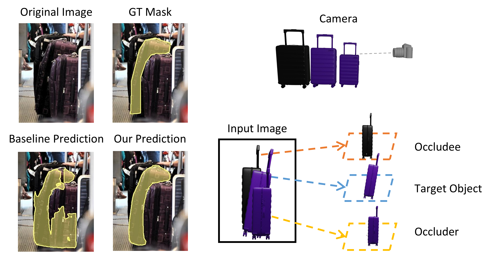
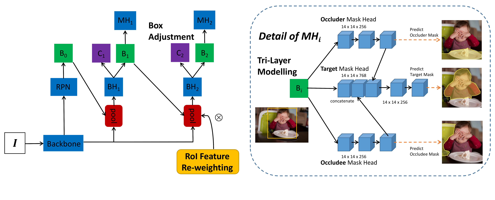
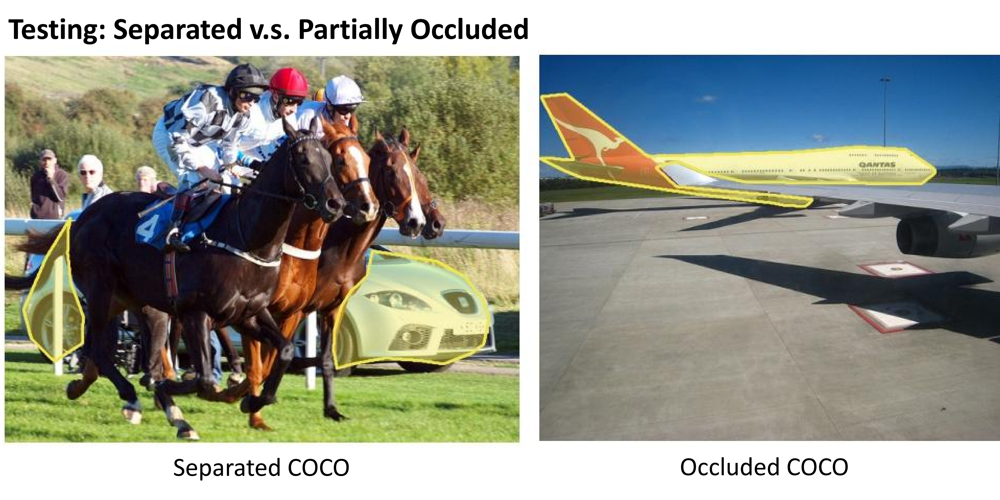
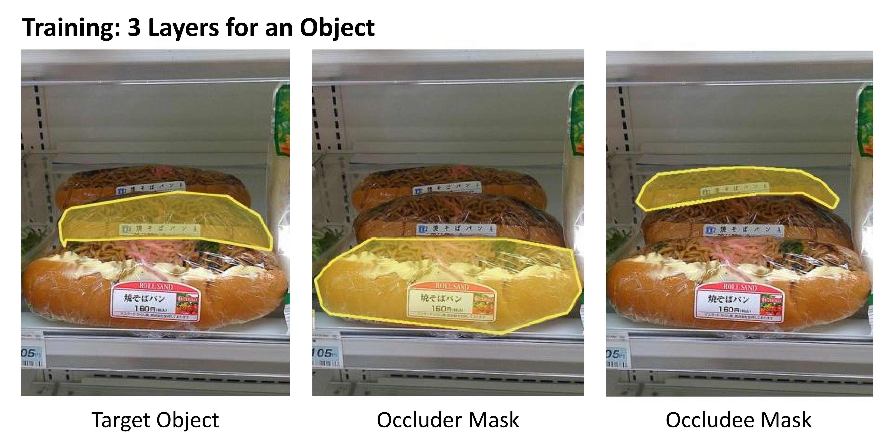

# A Tri-Layer Plugin to Improve Occluded Detection

This is the implementation of BMVC 2022 paper "A Tri-Layer Plugin to Improve Occluded Detection" by <a href="https://championchess.github.io/" target="_blank">Guanqi Zhan</a>, <a href="https://weidixie.github.io/" target="_blank">Weidi Xie</a>, and <a href="https://scholar.google.com/citations?user=UZ5wscMAAAAJ&hl=en" target="_blank">Andrew Zisserman</a>, including the novel automatically generated real-image evaluation dataset **Occluded COCO** and **Separated COCO** to monitor the capability to detect occluded objects.




- [paper link](https://www.robots.ox.ac.uk/~vgg/publications/2022/zhan22/zhan22.pdf)
- [project page](https://www.robots.ox.ac.uk/~vgg/research/tpod/)


## Installation

```
conda create --name occ python=3.7 -y
conda activate occ
conda install pytorch=1.10.0 torchvision torchaudio cudatoolkit=11.3 -c pytorch
pip install mmcv-full==1.4.0 -f https://download.openmmlab.com/mmcv/dist/cu113/torch1.10.0/index.html
git clone https://github.com/Championchess/Tri-Layer_Plugin_Occluded_Detection.git
cd Tri-Layer_Plugin_Occluded_Detection
pip install -v -e .
pip install ipdb
pip install scikit-image
```


## Data Preparation


Download the <a href="https://weidixie.github.io/" target="_blank">COCO dataset</a>, <a href="https://www.robots.ox.ac.uk/~vgg/research/tpod/datasets/occluded_coco.pkl" download> Occluded COCO dataset </a>, <a href="https://www.robots.ox.ac.uk/~vgg/research/tpod/datasets/separated_coco.pkl" download>Separated COCO dataset</a>, <a href="https://www.robots.ox.ac.uk/~vgg/research/tpod/datasets/front_mask_4_coco2017train_objects.pkl" download>Occluder Mask dataset</a>, <a href="https://www.robots.ox.ac.uk/~vgg/research/tpod/datasets/back_mask_4_coco2017train_objects.pkl" download>Occludee Mask dataset</a>, and then.
- In `tools/test.py` and `tools/test_ap.py` and `tools/test_recall_occluded_separated.py`, fill in the COCO dataset path, Occluded/Separated COCO dataset path, and result save path
- In `configs/_base_/datasets/coco_instance_occluder_tri.py`, fill in the COCO dataset path
- In `mmdet/datasets/coco_occluder_tri.py`, fill in the path to generated occluder(front)/occludee(back) masks dataset 


## Model
| Detector | Backbone | Plugin | Recall Occluded | Recall Separated | BBox mAP (val) | Mask mAP (val) | BBox mAP (test-dev) | Mask mAP (test-dev) | #params	| FLOPs | config | model |
| :---: | :---: | :---: | :---: | :---: | :---: | :---: | :---: | :---: |:---: | :---: | :---: |:---: |
| Mask R-CNN | Swin-T | ours | 3441(62.00%) | 1223(34.72%) | 48.5 | 43.0 | 48.7 | 43.4 | 77.6M | 583.33G | [config](configs/swin/mask_rcnn_swin_tiny_patch4_window7_mstrain_480-800_adamw_3x_coco_our_plugin.py) | [ckpt](https://www.robots.ox.ac.uk/~vgg/research/tpod/ckpts/swin-t_our_plugin.pth)|
| Mask R-CNN | Swin-S | ours | 3473(62.58%) | 1261(35.80%) | 50.3 | 44.2| 50.6 | 44.9 | 98.9M | 673.32G | [config](configs/swin/mask_rcnn_swin_small_patch4_window7_mstrain_480-800_adamw_3x_coco_our_plugin.py) | [ckpt](https://www.robots.ox.ac.uk/~vgg/research/tpod/ckpts/swin-s_our_plugin.pth)|
| Cascade Mask R-CNN | Swin-B | ours* | 3532(63.64%) | 1299(36.88%) | 52.1 | 45.4 | 52.7 | 45.9 | 164.3M | 1353.68G | [config](configs/swin/cascade_mask_rcnn_swin_base_patch4_window7_mstrain_480-800_giou_4conv1f_adamw_3x_coco_tri_layer.py) | [ckpt](https://www.robots.ox.ac.uk/~vgg/research/tpod/ckpts/swin-b_tri_layer.pth)|

- \*Only Tri-Layer Modelling is applied as Cascade Mask R-CNN has already used multiple iterations.


## Training

```
# batch_size = data.samples_per_gpu x num_gpu, we use batch_size=16 in our experiments, and set lr=1e-6
# single-gpu training
python tools/train.py <CONFIG_FILE> --no-validate --work-dir <WORK_DIR> --cfg-options data.samples_per_gpu=xxx optimizer.lr=xxx

# multi-gpu training
tools/dist_train.sh <CONFIG_FILE> <GPU_NUM> --no-validate --work-dir <WORK_DIR> --cfg-options data.samples_per_gpu=xxx optimizer.lr=xxx
```

## Inference

```
python tools/test.py <CONFIG_FILE> "" --eval bbox segm
```
to get the detection results of models, and then


### Test on COCO (bbox/mask mAP)

```
python tools/test_ap.py <CONFIG_FILE> "" --eval bbox segm
```

### Test on Occluded COCO & Separated COCO (recall)

```
python tools/test_recall_occluded_separated.py
```


## Citation
Please cite our paper if you use the code/model/dataset of this github.
```
@article{zhan2022triocc,
  title={A Tri-Layer Plugin to Improve Occluded Detection},
  author={Zhan, Guanqi and Xie, Weidi and Zisserman, Andrew},
  journal={British Machine Vision Conference},
  year={2022}
}
```
